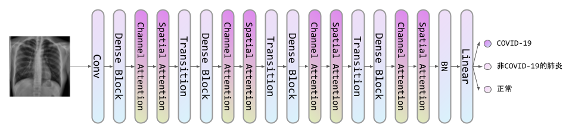
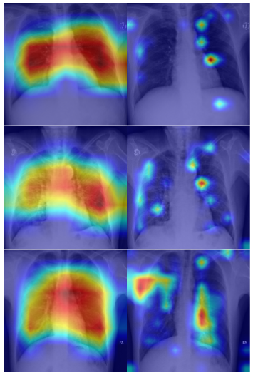

DenseNet121-CBAM
=
Model
-
DenseNet121-CBAM can be used to detect COVID-19 in chest X-ray.

DenseNet121-CBAM is DenseNet121 equiped with CBAM(Convlution Block Attention Module). The structure of DenseNet121-CBAM is as follows:

Result
-
The comparision between DenseNet121-CBAM and Li et al. is as follows:

Method | Accuracy
- | -
Li et al. SqueezeNet | 82.4
Li et al. MobileNetV2 | 88.0
Li et al. ShuffleNetV2 | **90.7**
DenseNet121-CBAM | 86.1

The visualization is as follows, images in the left are Li et al. ShuffleNetV2's and images in the right are DenseNet121-CBAM's.

Usage
-
``train_densenet121_cbam.py`` is used for training.

``test.py`` is used for testing.

The dateset used in this code and trained models are available at [here](https://pan.baidu.com/s/11b_xsLhIf6DQNbAhSH6VTA), the extraction code is aif0.